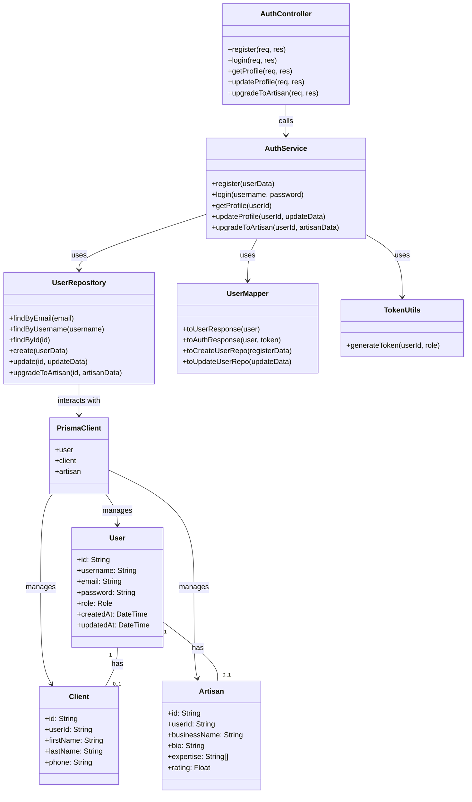

# UserService Architecture

The following diagram illustrates the architecture of the `UserService`, showing the relationships between controllers, services, repositories, and Prisma models.

```mermaid
classDiagram
    class AuthController {
        +register(req, res)
        +login(req, res)
        +getProfile(req, res)
        +updateProfile(req, res)
        +upgradeToArtisan(req, res)
    }

    class AuthService {
        +register(userData)
        +login(username, password)
        +getProfile(userId)
        +updateProfile(userId, updateData)
        +upgradeToArtisan(userId, artisanData)
    }

    class UserRepository {
        +findByEmail(email)
        +findByUsername(username)
        +findById(id)
        +create(userData)
        +update(id, updateData)
        +upgradeToArtisan(id, artisanData)
    }

    class UserMapper {
        +toUserResponse(user)
        +toAuthResponse(user, token)
        +toCreateUserRepo(registerData)
        +toUpdateUserRepo(updateData)
    }

    class TokenUtils {
        +generateToken(userId, role)
    }

    class PrismaClient {
        +user
        +client
        +artisan
    }

    class User {
        +id: String
        +username: String
        +email: String
        +password: String
        +role: Role
        +createdAt: DateTime
        +updatedAt: DateTime
    }

    class Client {
        +id: String
        +userId: String
        +firstName: String
        +lastName: String
        +phone: String
    }

    class Artisan {
        +id: String
        +userId: String
        +businessName: String
        +bio: String
        +expertise: String[]
        +rating: Float
    }

    AuthController --> AuthService : calls
    AuthService --> UserRepository : uses
    AuthService --> UserMapper : uses
    AuthService --> TokenUtils : uses
    UserRepository --> PrismaClient : interacts with
    PrismaClient --> User : manages
    PrismaClient --> Client : manages
    PrismaClient --> Artisan : manages
    User "1" -- "0..1" Client : has
    User "1" -- "0..1" Artisan : has
```
